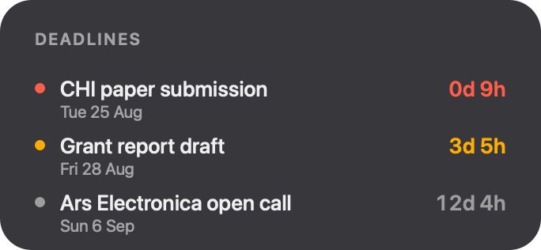

# Deadlines

A macOS desktop widget that keeps your project, conference, and submission deadlines in view — ranked soonest first, with days and hours remaining. A small menu bar app handles entry, editing, and reminder notifications. The widget is the product; the app stays out of the way.

<p align="center">
  
</p>

Local only: your deadlines live in a JSON file on your Mac. No accounts, no sync, no network, no third-party code.

## Install

1. Download **[Deadlines-0.1.0.dmg](https://github.com/npuckett/deadline-board/releases/download/v0.1.0/Deadlines-0.1.0.dmg)** (or grab the newest version from [Releases](https://github.com/npuckett/deadline-board/releases/latest)).
2. Open the DMG and drag **Deadlines** to **Applications**.
3. Launch Deadlines once — it appears as a calendar icon in the menu bar (no dock icon), and asks permission to send reminder notifications.
4. Add the widget: right-click the desktop, choose **Edit Widgets…**, search for *Deadlines*, and drag the medium or large widget onto the desktop.

The app is signed and notarized, so it opens without Gatekeeper warnings. Requires macOS 14 (Sonoma) or later.

## How to use

**Add a deadline** from the menu bar icon → *Add Deadline…* (⌘N), or just search **"Add Deadline"** in Spotlight to add one without opening a window. Each deadline has a title, a due date and time, an optional link, and reminder times.

**Read the widget** at a glance: deadlines are sorted soonest first, and the dot and countdown are color-coded — red under 24 hours, orange within 7 days, gray beyond that. When a deadline passes, it disappears from the widget automatically.

**Click a widget row** to open that deadline's link in your browser; if it has no link, the editor opens instead.

**Edit or delete** in the editor (menu bar → *Open Editor…*): click any deadline to open the same form as Add, where you can change anything or delete it. Filter with **Upcoming / Past / All** (⌘1/⌘2/⌘3) — passed deadlines collect under *Past* until you delete them.

**Reminders** fire at the times you pick per deadline (from 14 days to 1 hour before). Set the defaults for new deadlines in *Settings…*, along with **Launch at Login** so the widget stays current after a reboot.

## Development

The full specification is in [deadlines-widget-plan.md](deadlines-widget-plan.md).

### Requirements

- macOS 14.0 (Sonoma) or later
- Xcode 15 or later (full Xcode; Command Line Tools alone cannot build the widget extension)
- [XcodeGen](https://github.com/yonaskolb/XcodeGen) (`brew install xcodegen`) — the `.xcodeproj` is generated from `project.yml`

### Getting started

```bash
./scripts/bootstrap.sh
```

This checks the toolchain, generates `Deadlines.xcodeproj`, and prints anything missing. Then open the project in Xcode, or build from the command line:

```bash
xcodebuild -scheme Deadlines -destination 'platform=macOS' build
xcodebuild -scheme Deadlines -destination 'platform=macOS' test
```

After changing `project.yml` or adding/removing source files, regenerate with `./scripts/generate.sh`.

### Project structure

| Path | Purpose |
| --- | --- |
| `project.yml` | XcodeGen project definition — targets, entitlements, Info.plist content |
| `Shared/` | Model, store, countdown logic, App Intents — compiled into both targets |
| `DeadlinesApp/` | Menu bar host app (`LSUIElement`, no dock icon) |
| `DeadlinesWidget/` | Widget extension (medium and large desktop widgets) |
| `DeadlinesTests/` | Unit tests for the shared model and countdown logic |
| `scripts/` | `bootstrap.sh`, `generate.sh`, `release.sh`, icon/preview generators |

Data is a single `deadlines.json` in the App Group container (`SAV2V7GXQ5.group.com.puckett.Deadlines` — team-prefixed rather than the plan's `group.` style, because Xcode 15+ requires provisioning profiles for `group.`-style groups and macOS 15 adds a consent prompt for them), read by both targets.

### CI

`.github/workflows/build.yml` builds and runs tests on every push and pull request. Signing and notarization are deliberately excluded from CI — releases are produced locally where the Developer ID keys live.

### Release

Bump `MARKETING_VERSION` in `project.yml`, update `CHANGELOG.md`, then run `scripts/release.sh <notarytool-profile>`. The script archives, exports with Developer ID, verifies entitlements and hardened runtime, builds and signs the DMG, notarizes and staples it, and publishes a GitHub release.
